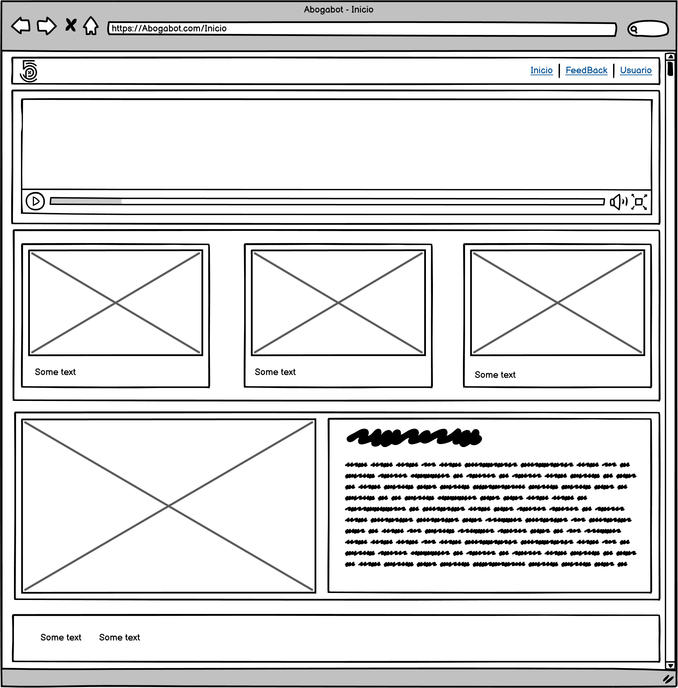
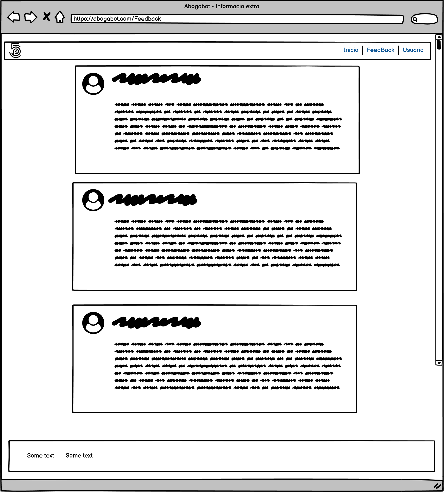
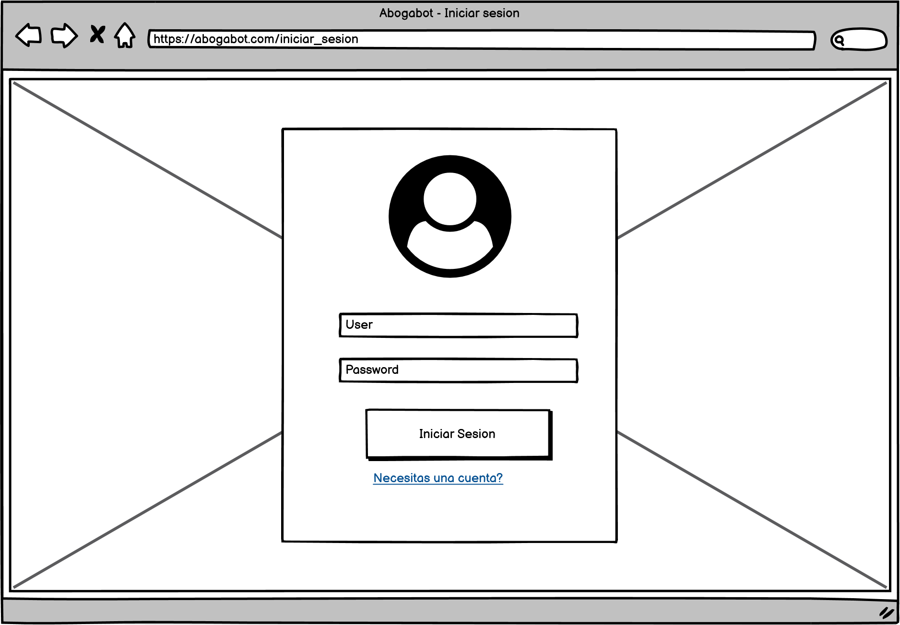
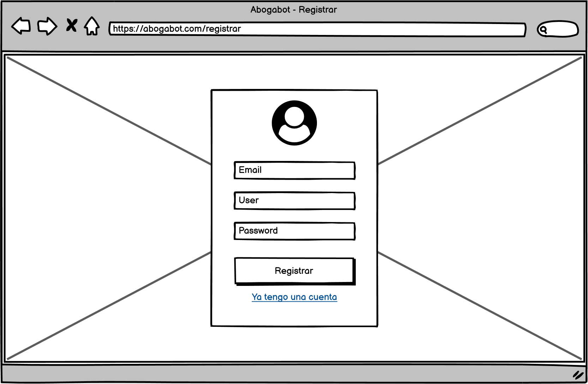

# Requerimientos
Entregable de la primera semana Launcher X
## **Caso: Abogabot Descripcion:**

- Es un despacho de abogados que quiere automatizar las demandas de sus clientes, esto lo harán a traves de una página web llenando un formulario.

- Al momento de llenar el formulario se manda al proceso de pago para finalizar la transacción.

- Para dar seguimiento a su demanda, el cliente crea una cuenta en la plataforma y verá el seguimiento de cada una de las actualizaciones del proceso legal.

- El administrador del sitio recbe la notificación de una nueva demanda y con los datos llenados del formulario se crea automaticamente el documento legal en formato word para empezar el proceso.

- El administrador recibe el pago y debe de ser capaz de verlo en un dashboard para ver la cantidad de ingresos recibidos.

- El administrador actualiza el proceso de la demanda y agrega comentarios en cada paso del proceso.

- Al usuario le llegan correos de notificación para saber el avance de su proceso.

- La página debe de ser responsive para poderla ver desde el celular.

- La preferncia de colores del cliente es azul marino y blanco, pero acepta propuestas.
---
### 1.	DESCRIPCION GENERAL DEL REQUERIMIENTO

 <table style="width: 100%; text-align: center;">
  <tr>
    <td style="width: 33%;">Proyecto: </td>
    <td style="width: 33%;">Abogabot</td>
  </tr>
  <tr>
    <td style="width: 33%;">Fecha Solicitud: </td>
    <td style="width: 33%;">18/02/2022</td>
  </tr>  
  <tr>
    <td style="width: 33%;">Dependencia Solicitante: </td>
    <td style="width: 33%;">Direccion General de Asuntos Juridicos</td>
  </tr>  
  <tr>
    <td style="width: 33%;">Responsable Solicitante: </td>
    <td style="width: 33%;">Harvy Specter</td>
  </tr>
</table>

---

### 2.	FASE DE FORMALIZACIÓN

<table style="width: 100%; text-align: justify;">
    <th>
      Descripcion del solicitante
    </th>
    <tbody>
        <tr>
            <td>
                Usuario solicitante
            </td>
        </tr>
        <tr>
            <td>
                Es un despacho de abogados que quiere automatizar las demandas de sus clientes, esto lo harán a través de una página web llenando un formulario.
Al momento de llenar el formulario se manda al proceso de pago para finalizar la transacción.
Para dar seguimiento a su demanda, el cliente crea una cuenta en la plataforma y verá el seguimiento de cada una de las actualizaciones del proceso legal. El administrador del sitio recibe la notificación de una nueva demanda y con los datos llenados del formulario se crea automáticamente el documento legal en formato word para empezar el proceso. El administrador recibe el pago y debe de ser capaz de verlo en un dashboard para ver la cantidad de ingresos recibidos. El administrador actualiza el proceso de la demanda y agrega comentarios en cada paso del proceso. Al usuario le llegan correos de notificación para saber el avance de su proceso. La página debe de ser responsive para poderla ver desde el celular. La preferencia de colores del cliente es azul marino y blanco, pero acepta propuestas.             
            </td>
        </tr>
        <tr>
            <td>
                Lider Funcional
            </td>
        </tr>
        <tr>
            <td>
                La aplicación ayudara a agilizar el proceso para solicitar una demanda contando un formulario que llenara el cliente del abogado, una vez terminado este proceso se redirigirá a las opciones de pago, cuando se termine el pago el administrador de la aplicación que en este caso seria el abogado a cargo del despacho podrá ver desde un dashboard un balance general del dinero recibido por parte de los clientes, también contara con opciones para todo el historial de pagos. El administrador se encargará de dar seguimiento a la demanda para así notificarlo a su cliente. El cliente ocupara crearse una cuenta, antes de haber hecho el proceso del formulario para así poder llevar un seguimiento de su demanda, las notificaciones se harán llegar a su correo y podrá ver todo el proceso desde su cuenta.
La aplicación debe ser totalmente responsiva para que permita su uso desde celular o cualquier dispositivo. El cliente también pide que se use preferentemente los colores azul marino y blanco.
            </td>
        </tr>
    </tbody>
</table>

---

### 3.	ANALISIS DE REQUISITOS Y REQUERIMIENTOS 

<table style="width: 100%; text-align: justify;">    
    <thead>
            <tr>
              <th colspan="2" style="text-align: center">
                Modelamiento de negocio
              </th>
            </tr>
    </thead>
    <tbody>
        <tr>
            <td colspan="2" style="text-align: center">
                
            </td>
        </tr> 
        <tr>
          <td colspan="2" style="text-align: center">
            Términos de Referencia
          </td>
        </tr>
        <tr>
            <td>
                Alcance de la Solucion
            </td>
            <td>
               El programa podrá registrar usuarios y tomar toda la información necesaria para poder generar el perfil de la demanda llenando un formulario el cual tendrá diferentes apartados dependiendo el tipo de demanda que se requiera, después de esto se llevara a una página que se encargara de tomar datos bancarios para realizar el pago del trámite de la demanda, una vez finalizado el administrador podrá mirar el saldo recibido dentro de la aplicación y de esta manera dar una actualización del proceso de la demanda en todo momento, el cual será notificado al cliente directamente a su correo.
            </td>
        </tr>  
        <tr>
            <td>
                Requerimientos Funcionales y criterios de aceptación 
            </td>
            <td>
               El usuario tendrá que registrarse, la información del usuario se registrará dentro de una base de datos sql para el correcto manejo y gestión de sesiones en la aplicación, posteriormente la información que se registra dentro del formulario de la demanda será agrupado y asignado a un bloque de memoria en la base de datos identificado por el usuario que lo genero. El pago será gestionado por una Api, la cual se encargará de mandar los datos de las transacciones a una base de datos donde de igual manera el pago se vinculará al usuario que realizo la petición de demanda, esta información podrá ser consultada directamente desde el perfil de administrador. El administrador podrá mandar un correo con la situación actual de la demanda, este correo será mandado directamente desde la aplican, para ello se requerirá un correo con el dominio de nuestra aplicación, de esta manera le gestionamos seguridad al cliente y podemos evitar fraudes.
            </td>
        </tr>  
        <tr>
            <td>
            Requerimientos no funcionales
            </td>
            <td>
               La aplicación contará con un color azul y blanco predominantes, además de que también tendrá un logotipo de la dependencia que realizo la solicitud. la aplicación también tiene que ser responsive para que los usuarios puedan consultar el proceso de sus demandas desde cualquier dispositivo, aparte de esto se busca una interfaz llamativa y fácil de usar para que el usuario no requiera de ayuda extra para hacer su proceso completamente solo.
            </td>
        </tr>  
        <tr>
            <td>
                Precondiciones
            </td>
            <td>
               Requerimos de un dominio para darle host a la aplicación al igual que un correo correspondiente con el dominio para poder realizar las notificaciones del proceso de demanda, es importante tener también un servidor para la base de datos ya que se estará utilizando MySQL.
            </td>
        </tr>  
        <tr>
                <tr>
                  <td>
                      Tipo de desarrollo
                  </td>
                  <td>
                    WEB
                  </td>
                </tr>
                <tr>                                    
                    <td>
                        Base de Datos
                    </td>
                    <td>
                        MySql
                    </td>
                </tr>
                <tr>                                    
                    <td>
                        Lenguaje
                    </td>
                    <td>
                        C# y JavaScirpt
                    </td>
                </tr>            
        </tr>  
    </tbody>
</table>

---

### 4.	FASE DE PLANEACIÓN Y GERENCIA DEL PROYECTO

<table>
	<thead>
		<tr>
			<td colspan="7" style="text-align: center;">
				Plan estratégico de fases del proyecto
			</td>
		</tr>
		<tr>
			<td>N°</td>
			<td>Nombre Etapa</td>
			<td>Actividad</td>
			<td>Rol Responsable</td>
			<td>Fecha Inicio</td>
			<td>Fecha Fin</td>
			<td>Comentarios</td>			
		</tr>
	</thead>
	<tbody>
		<tr>
			<td>1</td>
			<td>Toma de Requerimientos</td>
			<td>Se analizará todos los requerimientos necesarios para el completo funcionamiento de la aplicación</td>
			<td>Lider de funcionalidad</td>
			<td>18/02/2022</td>
			<td>25/02/2022</td>
			<td>Se debe poder tener un formato adecuado de Requerimientos para poder tener una facilidad legibilidad de lo que el cliente quiere que tenga su aplicación</td>
		</tr>
		<tr>
			<td>2</td>
			<td>Determinar el Buyer Person</td>
			<td>Se debe hacer un estudio que determine que buyer person estará destinada la aplicación</td>
			<td>Lider de funcionalidad</td>
			<td>25/02/2022</td>
			<td>02/03/2022</td>
			<td>Para poder avanzar con la aplicación tiene que haber una correcta identificación del buyer person.</td>
		</tr>
		<tr>
			<td>3</td>
			<td>Público Objetivo</td>
			<td>Delimitar el público objetivo</td>
			<td>Lider de funcionalidad</td>
			<td>02/03/2022</td>
			<td>05/03/2022</td>
			<td>La aplicación debe contar con un público objetivo de manera que sepamos a quienes está dirigido esta aplicación</td>
		</tr>
		<tr>
			<td>4</td>
			<td>Wireframe UI</td>
			<td>Crear Wireframes de la aplicacion en diferentes dispositivos</td>
			<td>Diseñador</td>
			<td>05/03/2022</td>
			<td>07/03/2022</td>
			<td>Antes de poder programar se necesita un wirframe para saber en que parte se colocara cada componente y que se pueda manejar intuitivamente</td>
		</tr>
		<tr>
			<td>5</td>
			<td>Wireframe UX</td>
			<td>Crear Wireframes UX</td>
			<td>Diseñador</td>
			<td>07/03/2022</td>
			<td>12/03/2022</td>
			<td>Sera importante tener una apliacion intuitiva y sobre todo llamativa</td>
		</tr>
		<tr>
			<td>6</td>
			<td>Desarrollo del Frontend</td>
			<td>Se comenzara a realizar la maquetacion y estilado de la aplicacion web</td>
			<td>Desarrollador Frontend</td>
			<td>12/03/2022</td>
			<td>16/03/2022</td>
			<td>Comenzaremos con las primeras alfas visuales con respecto a los wireframes realizados anteriormente</td>
		</tr>
		<tr>
			<td>7</td>
			<td>Desarrollo del Backend</td>
			<td>Se comenzara a implementar una base de datos a la aplicacion</td>
			<td>Desarrollador Backend</td>
			<td>16/03/2022</td>
			<td>20/03/2022</td>
			<td>Se implemenatara una base de datos Sql y la logica pertinente para el correcto funcionamiento de la aplicacion</td>
		</tr>
		<tr>
			<td>8</td>
			<td>Testeo</td>
			<td>Comenzar con las pruebas de la aplicacion</td>
			<td>Tester</td>
			<td>20/03/2022</td>
			<td>25/03/2022</td>
			<td>El tester se encargara de mostrar posibles problematicas con la aplicacion y erres que esta pueda tener</td>
		</tr>
		<tr>
			<td colspan="7" style="text-align: center;">
				Diagrama de Planeacion
			</td>		
		</tr>
		<tr>
			<td colspan="7">
				
			</td>
		</tr>
	</tbody>	
</table>

**NOTA: Las fechas de planeación establecidas en este documento son aproximadas y estarán sujetas a modificaciones que surjan por control de cambios u otros factores.**

---

### 5.	LEVANTAMIENTO DEL REQUERIMIENTO DETALLADO

Usuario 1:

<table>
	<thead>
		<tr>
			<th colspan="4" style="text-align: center;">
				Historia de usuario
			</th>
		</tr>
	</thead>
	<tbody>
		<tr>
			<td>N°.</td>
			<td colspan="3">1</td>
		</tr>
		<tr>
			<td>Titulo</td>
			<td colspan="3">Asesoria por parte juridica</td>
		</tr>
		<tr>
			<td>Fecha</td>
			<td colspan="3">30/03/2022</td>
		</tr>
		<tr>
			<td >Estimacion</td>
			<td  colspan="3">55</td>
		</tr>
		<tr>
			<th colspan="4" ">Características/Funcionalidad</th>			
		</tr>
		<tr>
			<td colspan="4" style="text-align: justify;">Me gustaria que antes de realizar una demanda pudiera tener acceso a un asesoriamiento por parte de un abogado y asi poder llenar mi solicitud de manera mas clara y concisa, ya que en algunos casos el tramite puede llegar a emplear palabras que no son de mi uso cotidiano.</td>
		</tr>
		<tr>
			<th colspan="4" >Razon/Resultado</th>
		</tr>
		<tr>
			<td colspan="4" style="text-align: justify;">Con la finalidad de que haya una mejor comprensión a la hora de realizar el proceso, se ha decidió agregar un apartado de chat en el cual podrá cuestionar diferentes dudas y serán resultas por un abogado a cargo</td>
		</tr>
		<tr>
			<th colspan="4">Criterios de Aceptacion</th>
		</tr>
		<tr>
			<th>N°</th>
			<th>Titulo</th>
			<th>Contexto</th>
			<th>Evento</th>
		</tr>
		<tr>
			<td style="text-align: center;">1</td>
			<td>Asesoria antes de llenar formulario</td>
			<td>En caso de que el usuario tenga dudas con la demanda que piensa realizar, debera entrar a un chat donde un abogado le atendera</td>
			<td>Antes de que el usurio realice el llenado del formulario de demanda</td>
		</tr>
	</tbody>
</table>

Usuario 2:

<table>
	<thead>
		<tr>
			<th colspan="4" style="text-align: center;">
				Historia de usuario
			</th>
		</tr>
	</thead>
	<tbody>
		<tr>
			<td>N°.</td>
			<td colspan="3">2</td>
		</tr>
		<tr>
			<td>Titulo</td>
			<td colspan="3">Informacion extra de los abogados</td>
		</tr>
		<tr>
			<td>Fecha</td>
			<td colspan="3">05/04/2022</td>
		</tr>
		<tr>
			<td >Estimacion</td>
			<td  colspan="3">34</td>
		</tr>
		<tr>
			<th colspan="4" ">Características/Funcionalidad</th>			
		</tr>
		<tr>
			<td colspan="4" style="text-align: justify;">Me agradaria mucho que hubiera una forma de conocer el perfil del abaogado que llevara el caso de la demanda al igual que tambien me gustaria que hubiera una seccion de comentarios y recomendaciones</td>
		</tr>
		<tr>
			<th colspan="4" >Razon/Resultado</th>
		</tr>
		<tr>
			<td colspan="4" style="text-align: justify;">Con la finalidad de que haya una mayor transparencia por parte de los abogados se agregara una seccion de feedback y el perfil de los abogados que estaran atendiendo las demadnas</td>
		</tr>
		<tr>
			<th colspan="4">Criterios de Aceptacion</th>
		</tr>
		<tr>
			<th>N°</th>
			<th>Titulo</th>
			<th>Contexto</th>
			<th>Evento</th>
		</tr>
		<tr>
			<td style="text-align: center;">1</td>
			<td>Perfil de abogados y Feedback</td>
			<td>Se mostrara en la pagina principal los skills de los abogados que atienden la aplicacion</td>
			<td>Desde el comienzo de la aplicacion se podra ver</td>
		</tr>
	</tbody>
</table>

Usuario 3:

<table>
	<thead>
		<tr>
			<th colspan="4" style="text-align: center;">
				Historia de usuario
			</th>
		</tr>
	</thead>
	<tbody>
		<tr>
			<td>N°.</td>
			<td colspan="3">3</td>
		</tr>
		<tr>
			<td>Titulo</td>
			<td colspan="3">Que haya una autorizacion previa antes de realizar el pago</td>
		</tr>
		<tr>
			<td>Fecha</td>
			<td colspan="3">06/04/2022</td>
		</tr>
		<tr>
			<td >Estimacion</td>
			<td  colspan="3">89</td>
		</tr>
		<tr>
			<th colspan="4" ">Características/Funcionalidad</th>			
		</tr>
		<tr>
			<td colspan="4" style="text-align: justify;">En lo personal creo que antes de realizar el pago un experto deberia poder analizar 
				la peticion y aceptarla o denegarla segun sea el caso, antes de que haya un pago</td>
		</tr>
		<tr>
			<th colspan="4" >Razon/Resultado</th>
		</tr>
		<tr>
			<td colspan="4" style="text-align: justify;">Para un mejor uso de la aplicacion se agregara un lapso de verificacion de 24 hrs 
				en el cual un abogado revisara la peticion y en caso de aceptarla mandara un link de cobro para continuar con el proceso de demanda</td>
		</tr>
		<tr>
			<th colspan="4">Criterios de Aceptacion</th>
		</tr>
		<tr>
			<th>N°</th>
			<th>Titulo</th>
			<th>Contexto</th>
			<th>Evento</th>
		</tr>
		<tr>
			<td style="text-align: center;">3</td>
			<td>Autorizar proceso de pago</td>
			<td>Justo en cuanto se termine el formulario se mostrara que fue un exito y en 24 hrs podra ver en el apartado de notificaciones si el proceso fue aceptado o no</td>
			<td>Ocurre justo despues de que el usuario llena el formulario y antes de pagar</td>
		</tr>
	</tbody>
</table>

Usuario 4:

<table>
	<thead>
		<tr>
			<th colspan="4" style="text-align: center;">
				Historia de usuario
			</th>
		</tr>
	</thead>
	<tbody>
		<tr>
			<td>N°.</td>
			<td colspan="3">4</td>
		</tr>
		<tr>
			<td>Titulo</td>
			<td colspan="3">Que haya una pestaña donde se categoricen las peticiones de demanda por gravedad</td>
		</tr>
		<tr>
			<td>Fecha</td>
			<td colspan="3">07/04/2022</td>
		</tr>
		<tr>
			<td >Estimacion</td>
			<td  colspan="3">100</td>
		</tr>
		<tr>
			<th colspan="4" ">Características/Funcionalidad</th>			
		</tr>
		<tr>
			<td colspan="4" style="text-align: justify;">Para que se permita una mejor organizacion de las 
				peticiones de las demandas se requiere una pestaña que pueda categorizar las peticiones por el tipo de peticion escogida a la hora del llenado del formulario</td>
		</tr>
		<tr>
			<th colspan="4" >Razon/Resultado</th>
		</tr>
		<tr>
			<td colspan="4" style="text-align: justify;">Se agregara en el dashboard un apartado que permita al encargado escoger que peticion revisar en funcion de la gravedad categorizada</td>
		</tr>
		<tr>
			<th colspan="4">Criterios de Aceptacion</th>
		</tr>
		<tr>
			<th>N°</th>
			<th>Titulo</th>
			<th>Contexto</th>
			<th>Evento</th>
		</tr>
		<tr>
			<td style="text-align: center;">4</td>
			<td>Categorizar Diferentes tipos de peticion</td>
			<td>Cuando la peticion sea mandada al administrador se hara un proceso por el cual se decidira en que categoria se encuentra</td>
			<td>Ocurre despues de haber llenado el formulario justo cuando la peticion llega al administrador</td>
		</tr>
	</tbody>
</table>

---

### 6.	DISEÑO DE LA ARQUITECTURA DE SOLUCION 

<table>
	<thead>
		<tr>
			<th>
				Vista Logica
			</th>
		</tr>
	</thead>
	<tbody>
		<tr>
			<td>
				
			</td>
		</tr>
		<tr>
			<th>
				Vista de implementacion
			</th>
		</tr>
		<tr>
			<td>
				
			</td>
		</tr>
		<tr>
			<th>
				Vista de Proceso
			</th>
		</tr>
		<tr>
			<td>
				
			</td>
		</tr>	
	</tbody>
</table>

---

## Buyer Person

Para el buyer person cree a Juan, quien nos ayuda a entender de manera mas practica el publico al que la aplicacion se esta dirigiendo.

---

## Publico Objetivo

Aqui se observa un esquema donde estan las caracterizticas que necesitamos evaluar a la hora de promocionar nuestra aplicacion.

---

## WireFrames UI

Este es el bosquejo de la aplicacion vista en funcionalidad

1. Inicio

2. FeedBack

3. Login
   

4. Registro

5. Inicio Depues de registrar

